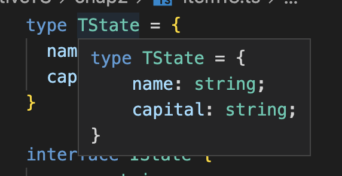

# Item 13. 타입과 인터페이스의 차이점 알기

타임스크립트에서 명명된 타입을 정의하는 방법은 두가지가 있다.

## 타입과 인터페이스
```ts
type TState = {
  name: string;
  capital: string;
}

interface TState {
  name: string;
  capital: string;
}
```

대부분의 경우에는 타입을 사용해도 되고, 인터페이스를 사용해도 된다. 그러나 타입과 인터페이스의 차이를 알고, 같은 상황에서는 동일한 방법으로 명명된 타입을 정의해 일관성을 유지해야한다.

## 공통점
명명된 타입은 인터페이스로 정의하든 타입으로 정의하든 상태에는 차이가 없다.

### 잉여 속성 감지
```ts
type TState = {
  name: string;
  capital: string;
}

interface IState {
  name: string;
  capital: string;
}

const wyoming: TState = {
  name: 'Wyoming',
  capital: 'Cheyenne',
  population: 500_000
  // 'population' does not exist in type 'TState'. 
};

const wyoming2: IState = {
  name: 'Wyoming',
  capital: 'Cheyenne',
  population: 500_000
  // 'population' does not exist in type 'IState'. 
};
```

타입과 인터페이스 모두 타입에 없는 추가 속성을 넣으려고 하면 잉여 속성을 잘 체크해서 동일한 오류를 발생한다.

### 인텍스 시그니처
```ts
type TDict = { [key: string]: string };
interface IDict { [key: string]: string }
```

### 함수 타입
```ts
type TFn = (x: number) => string;
interface IFn {
  (x: number): string;
}

const toStrT: TFn = x => '' + x;  // OK
const toStrI: IFn = x => '' + x;  // OK
```

단순한 타입에는 타입 별칭이 더 나은 선택이겠지만, 함수 타입에 추가적인 속성이 있다면 타입이나 인터페이스 어떤 것을 선택하든 차이가 없다.

```ts
type TFnWithProperties = {
  (x: number): number;
  prop: string;
}
interface IFnWithProperties {
  (x: number): number;
  prop: string;
}
```
자바스크립트에는 함수는 호출 가능한 객체의 의미이기 때문에 위처럼 작성할 수도 있다.

### 제네릭
```ts
type TPair<T> = {
  first: T;
  second: T;
}
interface IPair<T> {
  first: T;
  second: T;
}
```

### 확장
인터페이스는 타입을 확장할 수 있고, 타입은 인터페이스를 확장할 수 있다.

```ts
interface IStateWithPop extends TState {
  population: number;
}
type TStateWithPop = IState & { population: number; };
```

`IStateWithPop` 와 `TStateWithPop` 는 동일하다. 하지만 인터페이스는 유니온 타입 같은 복잡한 타입을 확장하지는 못한다. 복잡한 타입을 확장하고 싶다면 타입과 & 를 사용해야한다.

### 클래스
```ts
class StateT implements TState {
  name: string = '';
  capital: string = '';
}
class StateI implements IState {
  name: string = '';
  capital: string = '';
}
```

클래스를 구현할때는 타입과 인터페이스를 둘다 사용할 수 있다.

## 차이점

### 유니온
유니온 타입은 있지만 유니온 인터페이스는 없다.

```ts
type AorB = 'a' | 'b';
```

당연하게도 인터페이스는 객체 형태로 타입을 정의하는데 위처럼 유니온 형태를 인터페이스로는 표시할 수가 없다.

### 확장
인터페이스는 타입을 확장할 수 있지만, 유니온을 할 수 없다. 그런데 유니온 타입을 확장하는게 필요할 떄가 있다.

```ts
type Input = { /* ... */ };
type Output = { /* ... */ };
interface VariableMap {
  [name: string]: Input | Output;
}
```

`Input` 과 `Output` 은 변도의 타입이며, 이 둘을 하나의 변수명으로 매핑하는 `VariableMap` 인터페이스를 만들 수 있다.

type 키워드는 interface 보다 쓰임새가 많다. type 키워드는 유니온이 될 수도 있고, 매핑된 타입 또는 조건부 타입 같은 고급 기능에 활용되기도 한다.

## 튜플과 배열
객체 형태가 아닌 것들은 type 키워드를 사용하는 것이 좋다.
```ts
type Pair = [number, number];
type StringList = string[];
type NamedNums = [string, ...number[]];

// 이렇게도 할 수 있긴하다.
interface Tuple {
  0: number;
  1: number;
  length: 2;
}
const t: Tuple = [10, 20];  // OK
```

인터페이스를 사용해서 튜플을 표현할 수 있긴하지만, Array 타입이 아니므로, 메서드를 쓸 수 없다. 따라서 튜플과 리스트는 type 키워드로 구현하는 것이 낫다.

## 보강
인터페이스에는 타입에 없는 몇가지 기능이 있다.

`보강`은 이미 정의된 타입을 한번 더 정의하여, 속성을 추가하는 것이다.

```ts
interface IState {
  name: string;
  capital: string;
}
interface IState {
  population: number;
}
const wyoming: IState = {
  name: 'Wyoming',
  capital: 'Cheyenne',
  population: 500_000
};  // OK
```
위 예제 처럼 속성을 확장하는 것을 `선언 병합` 이라고 한다. 선언 병합은 주로 타입 선언 파일(6장, types.ts or ~.d.ts)에서 사용된다. 따라서 타입 선언 파일을 작성할 때는 선언 병합을 지원하기 위해 반드시 인터페이스를 사용해야 하며, 표준을 따라야 한다.

> 병합은 주로 라이브러리의 타입 정의 부분에서 사용된다.
>
> es5 문법의 Array 인터페이스는 lib.es5.d.ts 에 정의되어 있다. 그런데 tsconfig.json의 lib 목록에 ES2015 를 추가하면, lib.es2015.d.ts에 선언된 인터페이스를 병합한다. 결과적으로 es5, es2015 둘은 병합되어 모든 메서드를 지원하는 하나의 Array 타입을 얻는다.

```ts
type TState { // ❌ Duplicate identifier 'TState'.
  name: string;
  capital: string;
}
type TState { // ❌ Duplicate identifier 'TState'.
  population: number;
}
```

type 키워들 사용할 때는 중복되었다고 나온다.

## 인터페이스 vs 타입

- 복잡한 타입 -> 타입 별칭
- 간단한 객체 타입 -> 둘다 가능하나, 일관성과 보강의 관점을 고려
- API에 대한 타입 선언 -> 인터페이스
  - 추후에 수정될 때 새로운 필드를 병합할 수 있어 유용하기 때문
  - 그러나 프로젝트 내부적으로 사용되는 타입에 선언 병합이 발생하는 것은 잘못된 설계이므로, 타입을 사용해야 한다.

## 적용
|interface|type|
|---|---|
|||

아래 상황 외에는 일관된 규칙을 따른다. 예를 들면 "컴포넌트의 Props는 interface로 한다. 그 외에는 type 을 사용한다~"  

### 타입을 쓰는게 더 나은 경우
- extends, union 을 사용하는 경우
- 외부에서 import를 많이 하고, 그때 IDE에서 상세한 구조를 보기 원하는 경우
- 복잡한 타입
- 배열, 튜플, 리터럴 등 객체 형태가 아닌 경우

### 인터페이스
- extends나 union 이 아닌 단순한 객체 형태
- library를 정의하는 ~d.ts 파일
- 나중에 수정될 가능성이 있는 보강이 필요한 타입들
