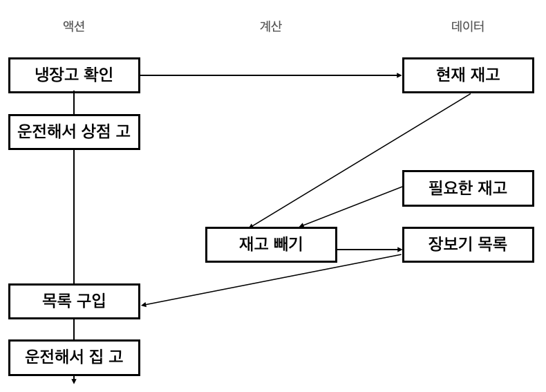

# [Functional Coding] Chap3. 액션과 계산, 데이터의 차이를 알기
> 코드에서 액션, 계산, 데이터를 분리해보자.

## 액션, 계산, 데이터
|종류|설명|예시|
|---|---|---|
|액션|실행 시점과 횟수에 의존, 부수효과 |이메일 보내기, DB 읽고 쓰기|
|계산|입력으로 출력을 계산, 순수함수, 수학함수|최댓값 찾기, 이메일이 올바른지 확인|
|데이터|이벤트에 대한 사실| 사용자 정보, 거래내역|

모든 개발 과정에서 액션, 계산, 게이터를 구분하는 기술을 적용할 수 있다.

1. 문제에 대해 생각할 때
	- 코딩 시작전에 문제를 미리 3가지로 나눠두면 코드 작성시 주의할 부분(액션), 데이터처리부, 계산부분을 명확히 할 수 있다.
2. 코딩할 때
	- 함수형 프로그래머는 최대한 액션에서 계산을 빼려고 한다.
	- 계산에서는 데이터를 분리할 수 있을지 생각한다.
	- 액션이 계산이 될 수 있는지, 계산이 데이터가 될 수 있는지 고민한다.
3. 코드를 읽을 때
	- 액션을 시간에 의존하기때문에 조심해야 한다.
	- 숨어있는 액션을 찾아 계산, 데이터와 분리하고 리팩터링 방법을 찾아야한다.

<details>
<summary>계산은 참조 투명</summary>
<p>

계산은 계산을 호출하는 코드를 계산 결과로 바꿀 수 있다. 예를 들어 add(2,3) 을 5로 바꿀 수 있다. 같은 입력에 대해 출력이 항상 같기 때문이다. 이처럼 호출 코드를 결과로 바꿀 수 있는 것을 `참조 투명` 이라고 한다. 

</p>
</details>

## 액션과 계산, 데이터는 어디에나 적용할 수 있다.
일반적인 프로그래머가 장보기 과정을 그린다면 아래 처럼 그릴 수 있다.

|과정|종류|이유|
|---|---|---|
|냉장고 확인하기|액션 |확인하는 시점에 따라 내용물이 다르기 떄문|
|운전해서 상점으로 가기|액션|두번 운전하면 기름값 두배로 나오기 때문|
|필요한 것 구입하기|액션|필요한 것에 따라 다르고, 두번 사는 것도 다르고, 늦게 가서 상품 없을 수도 있기 떄문|
|운전해서 집으로 오기|액션|집으로 두번가는 것은 다르며, 이미 집에 있으면 시행될 수 없음|

위 처럼 단계를 나눈다면 모두 액션이 된다. 다시 한번 살펴보자

### 냉장고 확인하기
냉장고를 확인하는 일은 액션이다. 그리고 냉장고를 확인해서 `현재 재고` 를 얻을 수 있다. 이것은 데이터이다.
> 데이터 : 현재 재고

### 필요한 것 구입하기
구입하는 것도 시점과 액션이 중요하기 떄문에 액션이다. 하지만 구입 전에 우리는 구매할 항목을 정할 수 있다. 필요한 물건과 위에서 구한 현재 재고를 파악하여 실제고 구입 항목 리스트를 만들 수있다.
> 데이터 : 현재재고
>
> 데이터 : 필요한 재고
>
> 계산 : 살 목록 리스트 만들기 (필요한 재고 - 현재 재고), 입력이 같으면 출력이 항상 같고 여러번 해도 동일하다.
>
> 데이터 : 장보기 목록 (위 게산으로 구해진 결과)
>
> 액션 : 목록에 있는 것 구입하기

위에서 더 작게 나눈 코드들을 아래처럼 표시할 수 있다.



각 단계를 더 작게 나눌 수도 있다. 계속 나누다 보면 더 복잡해진다고 생각할 수 있지만, 액션에 숨어있는 다른 액션이나 계산 또는 데이터를 발견하기 위해 나눌 수 있는 만큼 나누는 것이 좋다.

### 장보기 과정에서 배운 것
1. 액계데는 어디에나 적용할 수 있다.
2. 액션안에는 계산, 데이터, 또 다른 액션이 숨어있을 수 있다.
3. 계산은 더 작은 계산과 데이터로 나누고 연결할 수 있다.
4. 데이터는 데이터만 조합할 수 있다.
5. 계산은 때로 우리 머릿속에서 일어난다.(상품 목록을 종이에 쓰지 않고 머리로만 생각하는 경우 등)

<details>
<summary>데이터에 대해 자세히 알아보기</summary>
<p>

- 데이터는 이벤트에 대한 사실이다.
- 데이터는 종류에 따라 적절한 자료구조로 표현할 수 있다.
- 불변성
	- 카피-온-라이트 : 변경할 때 복사본을 만든다.
	- 방어적 복사 : 보관하려는 데이터의 복사본을 만든다.
- 데이터의 장점
	1. 직렬화 : 직렬화된 데이터는 이동 및 보관이 쉽고 활용도가 높다
	2. 동일성 비교
	3. 자유로운 해석
- 데이터의 단점
	- 해석해야만 의미를 가진다.

</p>
</details>

## 새로 만드는 고드에 함수형 사고 적용하기
> 쿠폰독의 새로운 마케팅 전략, 쿠폰독은 구독자에게 이메일로 쿠폰을 보내주는 서비스이다. 사용자가 추천한 친구수에 따라 best, good, bad 등급의 쿠폰을 이메일로 발송한다.

DB 는 아래와 같다. 즉, 데이터이다.
```ts
interface User {
	email: string;
	recCount: number; // 친구 추천 수
}

interface Coupon {
	name: string;
	rank: "good" | "bad" | "best";
}

type Users = User[]
type Coupons = Coupon[]

type Email = {
	to: string;
	coupon: string[];
}
```

액션은
- 이메일 보내기
- DB 에서 UserList 가져오기
- DB 에서 CouponList 가져오기

계산은
- 어떤 이메일이 어떤 쿠폰을 받을지 결정하기

### 쿠폰을 보내는 과정을 그려보기

```ts
// step1. 구독자 가져오기(액션)
function getUserList():Users {
	...
	return UserList
}

//step2. 쿠폰 가져오기(액션)
function getCouponList():Coupons {
	...
	return CouponList
}

// step3. 이메일 목록 만들기(계산)
function makeEmailList(userList: Users, couponList: Coupons): Email{
	... // 추천수 10명 이상이면 좋은쿠폰
	return emailList
}

// step4. 이메일 전송하기(액션)
function sendEmail(emailList: Email):void {
	...
} 
```

### 계산을 더 작게 나누기
위의 3번째 단계인 이메일 목록 만들기를 더 작게 나눠보자
```ts
// 쿠폰 필터링
function selectCouponListByRank(couponList: Coupons, rank: Coupon["rank"]): Coupons {
	return couponList.filter(coupon => coupon.rank === rank)
}

// 유저 랭크 구하기
function getUserLank(user: User) {
  return user.recCount >= 10 ? "best" : "good"
}

// 이메일 만들기
function makeEmail(user: User, goodCoupon: Coupons, bestCoupon: Coupons){
	const rank = getUserLank(user)
	if (rank === "best") {
		return {
			to: user.email,
			coupons: bestCoupon
		}
	} else {
		return {
			to: user.email,
			coupons: goodCoupon
		}
	}
}

// 이메일 리스트 만들기
function makeEmailList(users: Users, goodCoupon: Coupons, bestCoupon: Coupons) {
  return users.map(user => {
    return makeEmail(user, goodCoupon, bestCoupon)
  })
}

```

### 이메일 보내기
마지막으로 이메일 보내기 액션은 다음과 같다.
```ts
function sendEmails() {
  const users = getUserList() // 유저 가져오기(액션, DB fetch)
  const coupons = getCouponList() // 쿠폰 가져 오기 가져오기(액션, DB fetch)

  const goodCoupon = selectCouponListByRank(coupons, "good") // good 쿠폰 구하기(계산)
  const bestCoupon = selectCouponListByRank(coupons, "best") // best 쿠폰 구하기(계산)
  const emails = makeEmailList(user, goodCoupon, bestCoupon) // 이메일 목록 만들기(계산)

  emails.map(email => { // 보내기
    // 전송 시스템으로 이메일 전송
  })
}
```

결과적으로 위와 같이 이메일 전송 함수를 작성할 수 있다. `sendEmails` 는 액션과 계산들을 포함하는 액션이다.


### 사용자가 수백만명이라면 전체 이메일 구성하고나서 보내는 동작의 오버헤드가 크지 않나?
사용자가 많아짐에 따라 DB에서 유저를 가져오는 것, 유저의 등급을 메기는 것, 그리고 이메일을 만드는 작업의 시간이 늘어난다. 모든 메일 리스트를 만들고 나서 보내기 때문에 문제가 생길 수 있다.

이때는, 유저 리스트에 페이지네이션을 적용해서 일정 단위로 끊어서 메일을 보낼 수 있다.
```ts
function sendEmails() {
  const coupons = getCouponList()
  const goodCoupon = selectCouponListByRank(coupons, "good")
  const bestCoupon = selectCouponListByRank(coupons, "best")

	let page = 0
  let users = getUserList(page)

	while (users.length > 0) {
		const emails = makeEmailList(user, goodCoupon, bestCoupon)
		emails.map(email => { // 보내기
			// 전송 시스템으로 이메일 전송
		})
		page ++
		let users = getUserList(page)
	}
}
```
새로 변경된 `sendEmails` 액션을 보면, 게산은 전혀 바뀌지 않았다. 그저 변수와 loop 를 추가했을 뿐이다. 계산을 잘 분리해둔다면 함수를 수정하게 되더라도 변경 사항을 최소화하고 사이드 이펙트를 줄일 수 있다.

<details>
<summary>계산에 대해 자세히 알아보기</summary>
<p>

- 계산은 입력값으로 출력값을 만드는 것이다. 실행 시점이나 횟수에 관계없이 항상 같은 입력에 대해 같은 출력을 리턴한다. 순수함수, 수학함수라고도 한다.
- 계산에는 연산을 담을 수 있다. 입출력의 관계를 의미하기도 한다.
- 액션보다 계산이 좋은 이유
	1. 테스트가 쉽다
	2. 기계적인 분석이 쉽다.
	3. 조합하기 좋다.
- 계산을 쓰면서 걱정하지 않아도 되는 것
	1. 동시에 실행되는 것(인풋에만 의존하기 때문에, 병렬도 상관없음)
	2. 과거에 실행되었던 것이나 미래에 실행할 것
	3. 실행횟수
- 계산의 단점
	- 실행전에는 결과를 알 수 없음
</p>
</details>

## 이미 있는 코드에 함수형 사고 적용하기, 액션은 코드 전체로 퍼진다.
이미 존재하는 코드에서 액션, 계산, 데이터를 구분하는 경우 무언갈 전송하거나, DB에 보내는 행위는 분명한 액션이다. 하지만 더 많은 액션이 숨어있다. 액션을 호출하는 액션이 된다. 마찬가지로 그 함수를 호출하는 함수도 액션이고 결국 모두가 액션이게 된다.

## 액션은 다양한 형태로 나타난다.
일반적인 프로그래밍 언어는 액션과 계산을 구분하지 않는다. js에서 실행할 수 있는 액션을 알아보자
- alert("hello")
- console.log("hello")
- new Date()
- 표현식(함수 바깥 스코프의 변수 참조)
- 상태(값 할당; 공유 값인 경우, 속성 삭제)

이것들은 모두 액션이고, 언제 부르는지에 따라 다른 결과를 낼 수 있다. ~~React에서 state 다루는 함수는 결국 다 액션이다~~

<details>
<summary>액션에 대해 자세히 알아보기</summary>
<p>

- 액션은 외부 세계에 영향을 주거나 받는 것, 실행 시점이나 횟수에 의존
- 순수하지 않은 함수, 부수효과를 포함하는 함수
- 액션을 잘 다루기 위한 방법
	1. 액션을 최소화 한다.
	2. 액션을 가능한 작게 만든다.
	3. 액션이 외부 세계와 상호작용하는 것을 제한한다.
	4. 호출 시점에 의존하는 것을 제한한다.
</p>
</details>