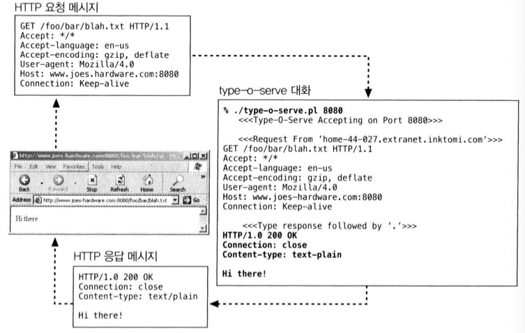
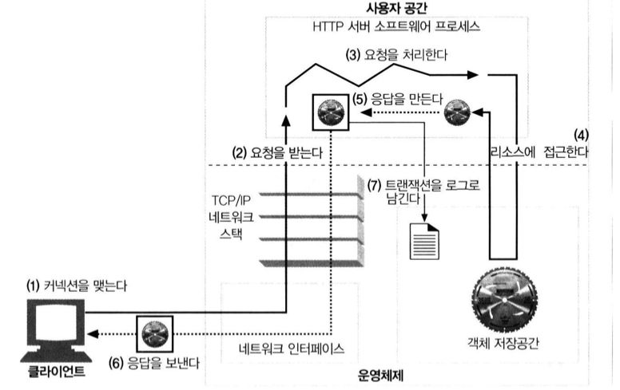
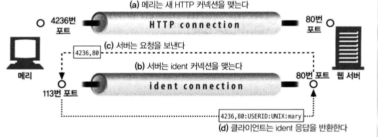
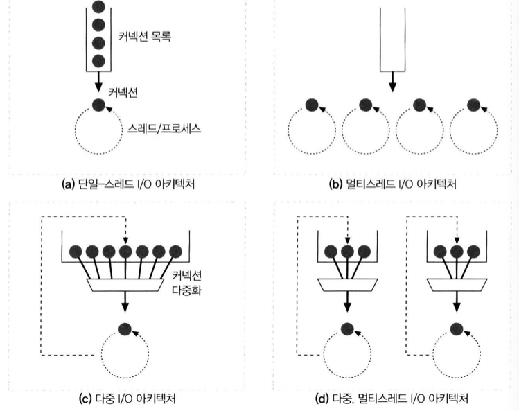
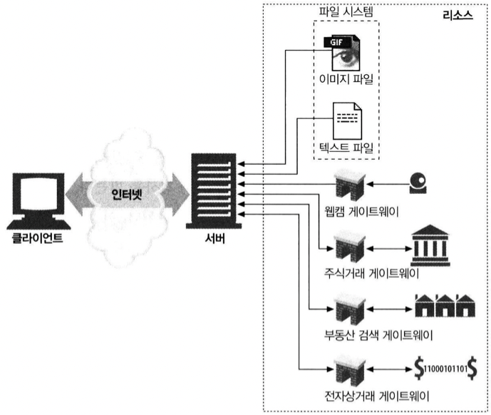

# [HTTP 완벽 가이드] Chap5. 웹 서버

## 1. 다채로운 웹 서버

- 웹 서버는 HTTP 요청을 처리하고 응답을 제공한다.
- `웹 서버`라는 용어는 웹 서버 소프트웨어와 컴퓨터 양쪽을 모두 가리킨다.
- 웹 서버는 기능, 형태, 크기가 다양하다.
- 모든 웹 서버는 리소스에 대한 HTTP 요청을 받아서 콘텐츠를 클라이언트에게 돌려준다.

### 1.1. 웹 서버 구현
- 웹 서버는 HTTP 및 그와 관련된 TCP 처리를 구현한 것이다.
- 웹 서버는 HTTP 프로토콜을 구현하고, 리소스를 관리하고, 서버 관리 기능을 제공한다.
- 웹 서버는 TCP 커넥션 관리에 대한 책임을 운영체제와 나눠 갖는다.
- 운영체제는 하드웨어를 관리하고, TCP/TP 네트워크 지원, 파일 시스템, 프로세스 관리를 제공한다.
- 웹 서버는 여러가지 형태가 가능하다.
  - 다목적 소프트웨어 웹 서버를 표준 컴퓨터 시스템에 설치하고 실행할 수 있다.
  - 마이크로프로세서로 몇 개의 칩만으로 구현된 웹서버를 전자 기기에 내장시켜 완전한 콘솔로 제공한다.

### 1.2. 다목적 소프트웨어 웹 서버
- 네트워크에 연결된 표준 컴퓨터 시스템에서 동작한다.
  - 아파치, W3C의 직소 같은 오픈 소스 소프트웨어 사용 가능
  - 마이크로소프트, 아이플래닛 같은 상용 소프트워에 사용 가능

> [22년 기준](https://w3techs.com/)은 Nginx가 38%로 1등이다.

### 1.3. 임베디드 웹 서버
- 임베디드 웹 서버는 일반 소비자용 제품에 내장될 목적으로 만들어진 작은 웹 서버이다. 예를 들면 프린터나 가전 제품이 있다.
- 몇몇 임베디드 웹 서버는 1제곱인치도 안되는 작은 크기로 구현되어 있고, 보통 최소한의 기능만을 제공한다.

## 2. 간단한 펄(Perl) 웹 서버
- 아파치 웹 서버의 코어는 5만 줄이 넘고, HTTP/1.1의 기능을 지원하려면 리소스 지원, 가상 호스팅, 접근 제어, 로깅, 설정, 모니터링, 등등 각종 기능이 필요하다.
- 그러나 최소한의 기능을 하는 HTTP 서버는 30중 이하의 펄(Perl) 코드로 만들 수 있다.

```bash
#!/usr/bin/perl
use Socket;
use Carp;
use FileHandle;

# (1) 명령줄에서 덮어쓰지 않는 이상 8080 포트를 기본으로 사용한다. pport = (@ARGV ? $ARGV[0] : 8080);

# (2) 로컬 TCP 소켓을 생성하고 커넥션을 기다리도록 (listen) 설정한다.
$proto = getprotobyname('top');
socket (S, PF_INET, SOCK_STREAM, sproto) || die;
setsockopt(S, SOL_SOCKET, SO_REUSEADDR, pack("l", 1)) || die;
bind(S, sockaddr_in($port, INADDR_ANY)) || die;
listen(S, SOMAXCONN) || die;

# (3) 시작 메시지를 출력한다.
printf(" <<<Type-o-Serve Accepting on Port %d>>>\n\n", $port);

while (1)
{
  # (4) 커넥션 C를 기다린다.
  $cport_caddr = accept(C, S);
  ($cport, $caddr) = sockaddr_in($cport_caddr); C->autoflush(1);

  # (5) 누구로부터의 커넥션인지 출력한다.
  $cname = gethostbyaddr($caddr, AF INET);
  printf(" <<<Request From '%s'>>>\n", $cname);

  # (6) 빈 줄이 나올 때까지 요청 메시지를 읽어서 화면에 출력한다. 
  while ($line = <C>)
  {
    print $line;
    if ($line =/^\r/) { last; }
  }


  # (7) 응답 메시지를 위한 프롬프트를 만들고, 응답줄을 입력 받는다.
  # "." 하나만으로 되어 있는 줄이 입력되기 전까지, 입력된 줄을 클라이언트에게 보낸다.

  printf(" <<<Type Response Followed by '.'>>>\n");
  while ($line = <STDIN>)
  {
    $line =~ /\//;
    $line =~ s/\n//;
    if (sline =~ /\./) { last; }
    print C $line . "\r\n";
    close(C);
  }
}

```

**type-o-server**

- 아래 코드는 `type-o-server` 라고 이름 붙은 작은 펄 프로그램이다.
- 이 프로그램은 클라이언트와 프락시 간의 상호작용 테스트에 유용한 진단 툴이다.
- 여느 웹 서버와 마찬가지로, type-o-server 는 HTTP 커넥션을 기다린다.
- type-o-server 는 요청 메시지를 받자마자, 화면에 출력한다.
- 그리고 클라이언트에게 답해줄 응답 페미지를 타이핑 하기를 기다린다.
- type-o-server 가 웹 서버를 흉내 내는 이 방식은, HTTP 요청 메시지를 정확하게 기록하고 어떤 HTTP 응답 메시지라도 돌려보내줄 수 있도록 해준다.



**type-o-server로 HTTP 통신 테스트하기**
1. 관리자는 특정 포트로 수신하는 type-o-server 진단 서버를 시작한다. 8080포트를 사용한다(안쓰는 포트 아무거나 상관 없음) `% type-o-server.pl 8080`
2. tos가 동작하기 시작하면, 이 웹 서버에 브라우저로 접근할 수 있다.
3. tos 프로그램은 브라우저로부터 HTTP 요청을 받아, 그 내용을 화면에 출력한 후, 관리자가 마침표로 끝나는 응답 메시지를 입력할 때까지 기다린다.
4. tos는 HTTP 응답 메시지를 브라우저에 돌려주고, 브라우저는 응답 메시지의 본문을 출력한다.

## 3. 진짜 웹 서버가 하는 일



1. 커넥션을 맺는다. - 클라이언트의 접속을 받거나, 닫는다
2. 요청을 받는다. - HTTP 요청 메시지를 네트워크로부터 읽어들인다.
3. 요청을 처리한다. - 요청 메시지를 해석하고 행동을 취한다.
4. 리소스에 접근한다. - 메시지에서 지정한 리소스에 접근한다.
5. 응답을 만든다. - 올바른 헤더를 포함한 HTTP 응답 메시지를 생성한다.
6. 응답을 보낸다. - 응답을 클라이언트에게 돌려준다.
7. 트랜잭션을 로그로 남긴다. - 로그파일에 트랜잭션 완료에 대한 기록을 남긴다.

## 4. 단계 1: 클라이언트 커넥션 수락
지속 커넥션을 사용하거나, 새 커넥션을 열어 커넥션을 수락한다.

### 4.1. 새 커넥션 다루기
- 클라이언트가 웹 서버에 TCP 커넥션을 요청하면, 웹서버는 요청에서 IP를 추출하여 클라이언트를 확인한다.
- 커넥션이 받아들여지면, 서버는 새 커넥션을 커넥션 목록에 추가한다.
- 웹 서버는 어떤 커넥션이든 마음대로 거절하거나 즉시 닫을 수 있다.
  - 클라이언트의 IP 주소나 호스트명이 인가되지 않았거나 악의적일 경우 커넥션을 닫는다.
  - 다른 신원 식별 기법도 사용될 수 있다.

### 4.2. 클라이언트 호스트명 식별
- 대부분의 웹 서버는 `역방향 DNS(reverse DNS)` 를 사용해서 클라이언트의 IP 주소를 호스트명으로 변환한다.
- 호스트명은 구체적인 접근 제어와 로깅을 위해 사용될 수 있다.
- 호스트명 룩업(lookup)은 꽤 많은 시간이 걸려, 트랜잭션을 느려지게 하기도 한다.
- 많은 대용량 웹 서버는 호스트명 분석을 꺼두거나 특정 콘텐츠에 대해서만 켜놓는다.
- 아파치에서는 HostnameLookups 설정 지시자로 호스트 명 룩업을 켤 수 있다.

### 4.3. ident 를 통해 클라이언트 사용자 알아내기
- 몇몇 웹 서버는 IETF ident 프로토콜을 지원한다.
- ident 프로토콜은 서버에게 어떤 사용자 이름이 HTTP 커넥션을 초기화헀는지 찾아낼 수 있게 해준다.
- 이 정보는 특히 웹 서버 로깅에 유용하기 때문에, 널리 쓰이는 일반 로그 포맷의 두번째 필드는 각 HTTP 요청의 ident 사용자 이름을 담고 있다.
- 만약 클라이언트가 ident 프로토콜을 지원한다면, 클라이언트는 TCP 포트 113번을 listen 한다.



ident는 조직 내부에서는 잘 사용할 수 있지만, 공공 인터넷에서는  신원 확인 프로토콜 미지원, 트랜잭션 지연, 방화벽, 프라이버스 등의 이유로 잘 동작하지 않는다.

## 5. 단계 2: 요청 메시지 수신
- 커넥션에 데이터가 도착하면, 웹서버는 이를 읽고 파싱하여 요청 메시지를 구성한다.
  1. 요청줄을 파싱하여, URI, 버전번호를 찾는다.
  2. 메시지 헤더를 읽는다.
  3. 본문을 읽는다.
- 요청 메시지를 파싱할 때 웹서버는 입력 데이터를 네트워크로부터 불규칙적으로 받는다.
- 커넥션은 언제라도 무효화될 수 있기 때문에, 메시지 일부를 메모리에 저장해둘 필요가 있다.

### 5.1. 메시지의 내부 표현
- 몇몇 웹 서버는 요청 메시지를 쉽게 다룰 수 있도록 내부의 자료구조에 저장한다.
- 파싱된 메시지외, 헤더는 해쉬 테이블 형식으로 저장되어 쉽게 접근할 수 있다.

### 5.2. 커넥션 입출력 처리 아키텍처
- 고성능 웹서버는 수천개의 커넥션을 동시에 열수 있다.
- 웹 서버는 항상 새 요청을 주시하고 있다.



#### 단일 스레드 웹서버
- 한번에 하나씩 요청을 처리한다.
- 구현이 간단하지만, 처리 도중에 모든 다른 커넥션을 무시된다.
- 심각한 성능문제를 야기하므로 type-o-server와 같은 진단도구에서만 적합하다.

#### 멀티프로세스와 멀티스레드 웹서버
- 여러 요청을 동시에 처리하기 위해 여러개의 프로세스 혹은 고효율 스레드를 할당한다.
- 프로세스와 스레드는 필요할 때마다 만들거나, 미리 만들어 둘 수있다.
- 수 많은 클라이언트에 대해 각각 프로세스나 스레드를 만드는 것은 리소스 소비가 많기 떄문에 최대 스레드/프로세스 개수에 제한이 있다.

#### 다중 I/O 서버
- 대량의 커넥션을 지원하기 위해, 많은 웹 서버는 다중 아키텍처를 채택했다.
- 다중 아키텍처에서는, 모든 커넥션은 동시에 그 활동을 감시당한다.
- 커넥션의 상태가 바뀌면, 그 커넥션에 대해 작은양의 처리가 수행된다.
- 처리가 완료되면, 커넥션은 다음번 상태 변경을 위해 열린 커넥션 목록으로 돌아간다.
- 어떤 커넥션에 대해 작업을 수행하는 것은 그 커넥션에 실제로 해야 할 일이 있을 때뿐이다.
- 스레드와 프로세스는 유휴 상태의 커넥션에 매여 기다리느라 리소스를 낭비하지 않는다.

#### 다중 멀티스레드 웹 서버
- 여러 개의 스레드는 각각 열려있는 커넥션을 감시하고 각 커넥션에 대해 조금씩 작업을 수행한다.

## 6. 단계 3: 요청 처리
- 웹 서버가 요청을 받으면, 이로부터 메서드, 리소스, 헤더, 본문을 얻어내어 처리한다.
- 엔터티가 필수인 요청, 옵셔널인 요청, 없어야 하는 요청이 있다.

## 7. 단계 4: 리소스 매칭과 접근
- 웹 서버는 각종 리소스를 제공한다.
- 요청 메시지의 URI에 대응하는 알맞는 리소스를 제공하기 위해 컨텐츠의 원천을 식별해야 한다.

### 7.1. Docroot
- 웹 서버는 여러 종류의 리소스 매핑을 지원한다. 가장 단순한 형태는 요청 URI를 웹 서버의 파일 시스템 안에 있는 파일 이름으로 사용하는 것이다.
- 일반적으로 웹 서버 파일 시스템의 특별한 폴더를 웹 콘텐츠를 위해 예약 해두는데, `문서 루트` 혹은 `Docroot` 라고 한다. 웹 서버는 요청 메시지에서 URI를 가져와서 문서 루트 뒤에 붙인다.
- Docroot는 `usr/local/httpd/files/` 이런식으로 될 수 있다.
- httpd.conf 설정 파일에 `DocumentRoot /usr/local/httpd/files` 를 추가하여 아파치 웹 서버의 문서 루트를 설정할 수 있다.
- 서버는 상대적인 url이 docroot를 벗어나서 그 밖의 부분이 노출되지 않도록 주의해야 한다. `cd ..` 등 상위 폴더로의 이동을 제한하는 것이 일반적이다.

#### 가상 호스팅된 docroot
- 가상 호스팅 웹 서버는, 각 사이트에 그들만의 분리된 문서 루트를 주는 방법으로 웹 서버 하나에 여러 웹 사이트를 호스팅한다.
- 가상 호스팅 웹서버는 URI, Host 헤더에서 얻은 IP 주소나 호스트명을 이용해 올바른 문서 루트를 식별한다.

```bash
// Nginx sites-available/default
...
server {
	listen 80 default_server; # ipv4 http 기본 포트
	listen [::]:80 default_server; # ipv6

...

	root /var/www/dist; # serve할 정적 파일 경로

	# Add index.php to the list if you are using PHP
	index index.html index.htm index.nginx-debian.html; # index 파일 이름

	server_name _; # 도메인 네임 적어주면 됨, 안적어도 상관 없음

	location / {
		# First attempt to serve request as file, then
		# as directory, then fall back to displaying a 404.
		try_files $uri $uri/ =404; # 없는 파일에 접근할 경우 404 페이지 보여준다는 뜻
	}

...
}
```

#### 사용자 홈 디렉터리 docroots
- docroot의 또 다른 대표적인 활용은, 사용자들이 한 대의 웹서버에서 각자 개인의 웹 사이트를 만들 수 있게 해주는 것이다.
- 보통 빗금(/)과 물결표(~) 다음에 사용자 이름이 오는 것으로 시작하는 URI는 (ex. /~bob/index.html) 그 사용자의 개인 문서 루트를 가리킨다.

### 7.2. 디렉터리 목록
- 웹서버는 경로가 파일이 아닌 디렉터리를 가리키는 URI 요청을 받을 수 있다.
- 이때 몇가지 다른 행동을 취하도록 설정할 수 있다.
  - 에러 메시지 반환
  - index.html 파일 반환
  - 디렉터리 내용을 탐색하여 그 내용을 담은 HTML 페이지를 반환
- 아파치 웹 서버에서 DirectortIndex 설정 지시자를 사용해서 기본 디렉터리 파일로 사용될 파일 이름의 집합을 설정할 수 있다. 색인 파일로 사용될 파일 이름을 우선순위로 나열한다. `DirectoryIndex index.html index.htm home.html homt.htm indxs.cgi`
- 기본 색인 파일이 없고, 색인 기능이 꺼져있다면, 자동으로 그 디렉터리의 파일 크기, 변경일, 파일에 대한 링크와 함께 열거한 HTML을 반환하여 편리하지만, 모든 파일이 노출되어 좋지 않다. 이 기능도 끌 수 있다. `Options -Indexes`

### 7.3. 동적 콘텐츠 리소스 매핑
- 웹 서버는 URI를 동적 리소스에 매핑할 수도 있다.
- 어떤 리소스가 동적이라면, 애플리케이션 서버는 그에 대한 동적 콘텐츠 생성 프로그램이 어디 있는지, 어떻게 실행하는지 알려준다.



- 아파치는 URI의 경로명이 실행 가능한 프로그램이 위치한 디렉토리로 매핑되도록 설정하는 기능을 제공한다.
- 서버가 실행 가능한 경로명을 포함한 URI로 요청 받으면, 그에 대응하는 프로그램을 찾으려시도한다.
  - `ScriptAlias /cgi-bin/ /usr/local/etc/httpd/cgi-programs/`
  - `AddHandler cgi-script .cgi` 를 설정하면 특정 확장자의 파일만 설정할 수 있다.


### 7.4. 서버사이드 인클루드(Server-Side Includes, SSI)
- SSI (Server Side Includes)는 HTML 페이지에 사용하는 지시어로, 페이지를 서비스할때 서버가 처리한다.
- 서버는 콘텐츠에 변수 이름이나 내장된 스트립트가 될 수 있는 어떤 특별한 패턴이 있는지(주로 특별한 HTML 주석 안에 포함된다) 검사를 받는다.

### 7.5. 접금 제어
- 웹 서버는 또한 각각의 리소스에 접근 제어를 할당할 수 있다.
- 제어되는 리소스에 접근할 떄는 아이디와, 비밀번호를 물어볼 수 있다.

## 8. 단계 5: 응답 만들기
- 서버가 리소스를 식별한면, 트랜잭션을 처리한 후 응답 메시지를 반환한다.
- 응답 메시지는 상태코드, 헤더, 본문을 포함한다.

### 8.1. 응답 엔터티
- 트랜잭션이 응답 본문을 생성한다면, 그 내용을 메시지에 담아 보낸다.
- Content-Type 헤더, Content-Length 헤더, 응답 본문이 있다.

### 8.2. MIME 타입 결정하기
- 웹서버는 응답 본문의 MIME 타입을 결정할 책임이 있다.
- 다음은 MIME 타입과 리소스를 연결하는 방법이다.

|방법|내용|
|---|---|
|mime.types| 파일 이름의 확장자를 사용하여 탐색한다.|
|매직 타이핑| 파일 내용을 검사하여 패턴 테이블(매직 테이블)을 조회한다. 느리지만, 표준 확장자가 아닌 경우에 편리하다.|
|유형 명시| 특정 파일이나 디렉터리 안에 있다면 확장자나 내용에 관계없이 어떤 MIME 타입을 갖도록 지정할 수 있다.|
|유형 협상|한 리소스가 여러 종류의 문서 형식에 속하도록 설정한다. |

### 8.3. 리다이렉션
- 웹 서버는 종종 성공 메시지 대신 리다이렉션 응답을 반환하며, 이때 상태코드는 300번대이다.
- Location 응답 헤더로 새로운 URI를 포함한다.

|리다이렉트가 유용한 경우|내용|
|---|---|
|영구히 리소스가 옮겨진 경우|새로운 위치로 옮겨졌거나 이름이 변경된 경우, 클라이언트는 북마크를 갱신하거나 할 수 있다고 말해준다. `301 Moved Permanently` 상태코드는 이런 종류의 리다이렉트를 위해 사용된다.|
|임시로 리소스가 옮겨진 경우|임시로 옮겨지거나 변경된 경우는 새로 갱신을 원하지 않기 때문에 `303 See Other`, `307 Temporary Redirect` 를 사용한다.|
|URL 증강| 서버는 종종 문맥 정보를 포함시키기 위해 재 작성된 URI로 리다이렉트 한다. 요청이 도착했을 때, 서버는 상태 정보를 내포한 새 URL을 생성하고 사용자를 이 새 URL로 리다이렉트 한다. 클라이언트는 상태정보가 포함된 완전한 URL로 요청을 다시 보내며, 이는 트랜잭션 간 상태를 유지하는 유용한 방법이다. 303, 307을 사용한다.|
|부하 균형| 서버가 과부하 되었다면, 부하가 덜한 서버로 리다이렉트 할 수 있다. 303, 307을 사용한다.|
|친밀한 다른 서버가 있을 때|그 클라이언트의 정보를 가진 다른 서버로 리다이렉트 할 수 있다. 303, 307을 사용한다.|
|디렉터리 이름 정규화| 클라이언트가 URI에 빗금(/)을 빠뜨렸다면 이를 붙인 URL로 리다이렉트한다.|

## 9. 단계 6: 응답 보내기
- 비지속 커넥션은 모든 응답 메시지를 전송했을 때 출력 채널을 닫는다.
- 지속 커넥션은, 서버가 Content-Length 헤더를 바르게 계산하기 위해 특별한 주의를 필요로 하는 경우나, 클라이언트가 응답이 언제 끝나는지 알 수 없는 경우에, 커넥션이 열린 상태를 유지한다.

## 10. 단계 7: 로깅
- 트랜잭션이 완료되었을 때 트랜잭션 수행 로그를 로그파일에 기록한다.
