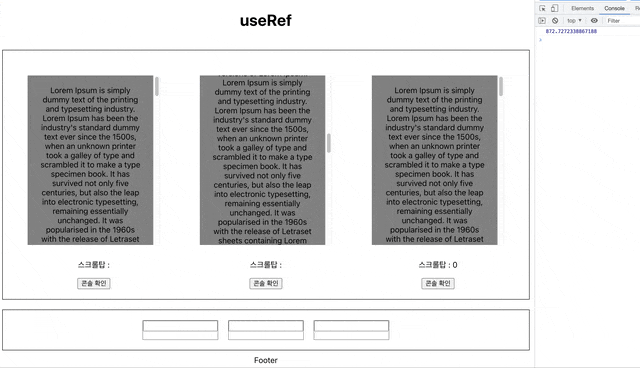
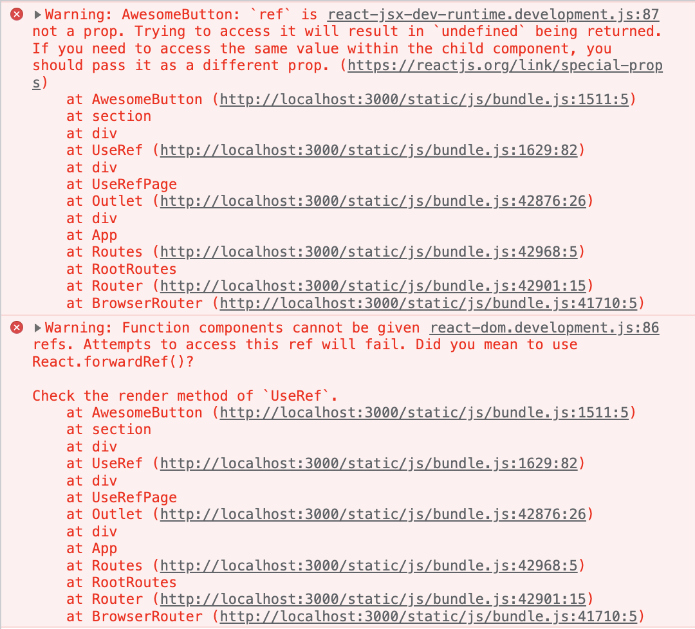

# React useRef + typesscript

## useRef
> useRef는 .current 프로퍼티로 전달된 인자(initialValue)로 초기화된 변경 가능한 ref 객체를 반환합니다. 반환된 객체는 컴포넌트의 전 생애주기를 통해 유지될 것입니다. [- React 공식문서](https://ko.reactjs.org/docs/hooks-reference.html#useref)

```js
const refContainer = useRef(initialValue);
```
일반적으로 React에서 데이터를 다루기 위해서 useState를 많이 쓴다. 하지만 state는 리액트 생명주기에 따라 변경을 감지하고, 그 값이 변경될 때마다 컴포넌트를 re-rendering 한다. 이러한 이유로 state는 화면에 보여져야 하는 값을 다룰 때 사용한다.

하지만 어떤 데이터는 화면에는 보여질(render) 필요 없이, 그저 그 데이터 자체를 다룰 필요가 있다. 또 react는 기본적으로 데이터의 흐름이 부모 컴포넌트에서 자식 컴포넌트로 흐르며, 자식 컴포넌트에서 부모 컴포넌트의 데이터를 직접 수정할 수 없다. 하지만 경우에 따라 부모 컴포넌트가 자식 컴포넌트의 데이터를 받아야 하거나, 직접 조작할 필요가 있을 수 있다.

위와 같은 상황에서 사용하는 Hook이 `useRef` 이다. `useRef` 는 `.current` 속성을 가지는 객체 형태로, 변경 가능한 값을 담고 있는 상자와 같다. useRef를 가장 대표적으로 사용하는 예시는 `Html Dom`을 조작하는 것이다.

```html
<div ref={myRef}/>
```

위 처럼 React로 ref 객체를 전달하면, React는 노드가 변경될 때 마다 변경된 DOM 노드를 `ref.current` 에 설정한다. 하지만 이는 리액트의 re-rendering을 유발하지 않으며, `ref` 나 `ref.current`의 변화는 `useEffect` 로 감지되지 않는다. `useEffect`는 mount 혹은 re render 후에 실행되기 떄문이다.

아래처럼 쓰더라도, 리액트는 ref의 변경값을 감지하지 못한다.
```js
useEffect(() => {
  ...
}, [ref.current])
```

특정 노드가 랜더 attach, detach 되었음을 확인하기 위해서는 [콜백 ref](https://ko.reactjs.org/docs/hooks-faq.html#how-can-i-measure-a-dom-node) 를 사용할 수 있다.


## Example
> [코드](https://github.com/parkjisu6239/React-Play-Ground/blob/926c9e8b5357f8fa5248f0ef5977dc277998a46c/src/components/templates/UseRef/UseRef.tsx)



위 이미지의 첫번째, 두번째 텍스트 박스는 `useRef` 를 사용했다. 스크롤탑의 위치를 출력하기 위해 <p> 태그 안에 `{divRef.current?.scrollTop}` 를 두었다. 하지만 위의 결과에서 볼 수 있듯이, 화면은 업데이트 되지 않는다. 하지만 콘솔을 찍어보면 값은 변경되고 있음을 알 수 있다. render가 되지 않기때문에, 화면이 바뀌지 않은 것이다.
```js
<div>
  <div
    className={divWrapperCss}
    id="refDiv"
    ref={divRef}>
    {lorem}
  </div>
  <p>스크롤탑 : {divRef.current?.scrollTop}</p>
  <button
    onClick={() => console.log(divRef.current?.scrollTop)}
  >
    콘솔 확인
  </button>
</div>
```

가장 오른쪽 블럭은 `onScroll` 이벤트와 `useState` 를 이용해서 스크롤 이벤트가 발생할 때마다 state를 갱신하고 있다. state가 변경될 때마다 리랜더링이 일어나므로, 화면에 바로 변경된 값이 보여진다.
```js
const [scrollTop, setScrollTop] = React.useState(0);

const handleScroll = (e: React.UIEvent<HTMLDivElement>) => {
    setScrollTop(e.currentTarget.scrollTop);
  };

...

<div>
  <div id="JustDiv" className={divWrapperCss} onScroll={handleScroll}>
    {lorem}
  </div>
  <p>스크롤탑 : {scrollTop}</p>
  <button
    onClick={() => console.log(scrollTop)}
  >
    콘솔 확인
  </button>
</div>
```

또한, ref 로 변경되었지만 랜더되지 않았던 값들도 state가 변하면서 전체가 re-render 되어 업데이트된 값으로 변하는 것을 볼 수 있다.

## Ref type

useRef를 사용하다보니 약간의 제너럴 타입과, null이 있고 없고에 따라 서로 다른 타입이 지정된다는 것을 확인했다. 아래 처럼 제네릭 타입으로 유니온 널이 없으면 `RefObject` 이고, 없으면 `MutableRefObject` 이 된다.

```ts
const inputRef = React.useRef<HTMLInputElement>(null); // React.RefObject<HTMLInputElement>
const inputRef2 = React.useRef<HTMLInputElement | null>(null); // React.MutableRefObject<HTMLInputElement | null>
```

`MutableRefObject` 은 이름에서도 볼 수 있듯이, 변경 가능하다는 것을 의미한다. 설명을 보면 `MutableRefObject` 은 `ref.current = "~~"` 와 같이 current 값을 직접 수정할 수 있다. 반면 `RefObject` 는 `current`가 `readonly` 라서 수정 불가하다. 직접 dom 요소에 연결한 후에는 임의로 수정할 수 없는 것이다.

```ts
type LegacyRef<T> = string | Ref<T>;
type Ref<T> = RefCallback<T> | RefObject<T> | null;

type RefCallback<T> = { bivarianceHack(instance: T | null): void }["bivarianceHack"];

interface MutableRefObject<T> { // current 직접 수정 가능
  current: T;
}

interface RefObject<T> { // current가 readonly 라서 수정 불가
  readonly current: T | null;
}

type ForwardedRef<T> = ((instance: T | null) => void) | MutableRefObject<T | null> | null;
```

## Ref 전달하기
> Ref 전달하기는 일부 컴포넌트가 수신한 ref를 받아 조금 더 아래로 전달(즉, “전송”)할 수 있는 옵트인 기능입니다.

일반적으로 ref를 쓸일은 그리 많지 않지만, 버튼의 포커스를 제어하거나, DOM 요소를 직접 컨트롤 할 때는 필요하다. 그리고 button은 여러 컴포넌트에 걸쳐 사용하고, 대부분 아주 말단에 연결되어 있다. 이때, 버튼의 포커싱을 제어하기 위해 가장 말단 노드인 버튼의 ref와 이를 사용하고 관리하려는 상위 컴포넌트와 연결이 필요하다.



useRef는 기본적으로는 사용하고자하는 컴포넌트에서 직접 사용해야 한다. ref는 props가 아니다. 그래서 ref를 props 로 전달하려고 하면 위와 같은 에러가 발생한다. Ref를 전달하기 위해서는 `ForwardedRef` 가 필요하다.

```js
const FancyButton = React.forwardRef(
  (
    props: React.PropsWithChildren<unknown>,
    ref: React.ForwardedRef<HTMLButtonElement>
  ) => (
    <button ref={ref} className="FancyButton">{props.children}</button>
  )
);

...

const Parent = () => {
  const buttonRef = React.useRef<HTMLButtonElement>(null);

  return <FancyButton ref={buttonRef}>buttonRef</FancyButton>
}
```

이렇게 사용하면 오류 없이 하위 컴포넌트에 ref 를 전달할 수 있다. 자세한 내용은 [Ref 전달하기](https://ko.reactjs.org/docs/forwarding-refs.html) 에서 볼 수 있다.

## 참고
- [React hooks-reference](https://ko.reactjs.org/docs/hooks-reference.html#useref)
- [Ref 전달하기](https://ko.reactjs.org/docs/forwarding-refs.html)